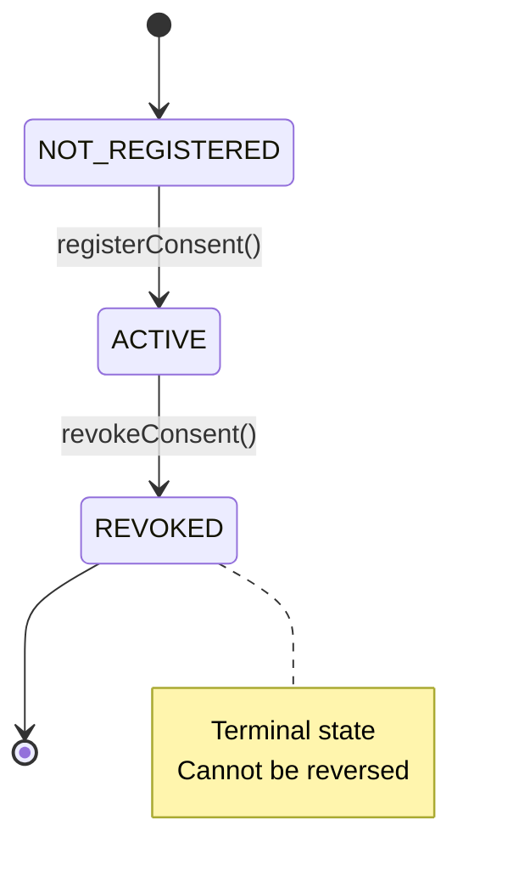
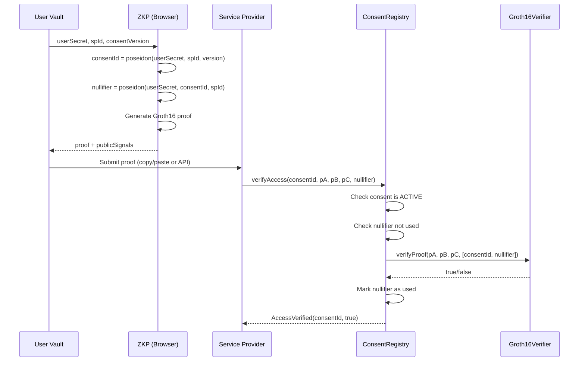

# RightToBeForgotten

Decentralized privacy-preserving consent management using Zero-Knowledge Proofs and Cryptographic Erasure.

A proof-of-concept demonstrating how the Right to be Forgotten can coexist with blockchain immutability.

---

## Problem

Blockchain data is immutable. Privacy regulations like GDPR grant users the right to erasure. These two properties conflict directly.

**RightToBeForgotten** resolves this by implementing _Cryptographic Erasure_ — instead of deleting data, the system permanently destroys the ability to verify, associate, or access user-related information.

---

## Architecture

```
┌──────────────────────┐
│     User Vault       │
│   Next.js + React    │
│   Identity + Proof   │
└──────────┬───────────┘
           │ Generate ZK Proof (browser)
           ▼
┌──────────────────────┐
│     ZKP Layer        │
│  Circom + SnarkJS    │
│  Groth16 (BN254)     │
└──────────┬───────────┘
           │ Submit Proof
           ▼
┌──────────────────────┐
│  ConsentRegistry     │
│  Solidity (Polygon)  │
│  Verify + Track      │
└──────────┬───────────┘
           │ Verify Access
           ▼
┌──────────────────────┐
│  Service Provider    │
│  Next.js Demo App    │
│  Access Control      │
└──────────────────────┘
```

### System Architecture (Mermaid)

```mermaid
graph TB
    User[User] --> UV[User Vault<br/>Next.js + Wagmi v2]
    UV --> |Generate Identity| IDB[(IndexedDB<br/>PBKDF2 + AES-GCM)]
    UV --> |Generate Proof| ZKP[ZKP Layer<br/>Circom + SnarkJS]
    ZKP --> |consentId, nullifier, proof| UV
    UV --> |registerConsent / revokeConsent| CR[ConsentRegistry<br/>Polygon Amoy]
    UV --> |proof + publicSignals| SP[Service Provider]
    SP --> |verifyAccess(proof)| CR
    CR --> |Groth16Verifier| GV[Verifier.sol]
    CR --> |AccessVerified event| SP

    style UV fill:#3b82f6,color:#fff
    style CR fill:#10b981,color:#fff
    style ZKP fill:#8b5cf6,color:#fff
    style SP fill:#f59e0b,color:#fff
```

---

## How It Works

### Consent Lifecycle



### ZKP Verification Flow



---

## Technology Stack

| Layer                | Technology                          | Purpose                                              |
| -------------------- | ----------------------------------- | ---------------------------------------------------- |
| **ZKP**              | Circom v2, SnarkJS, Groth16         | Privacy-preserving proof generation and verification |
| **Smart Contracts**  | Solidity 0.8.24, Hardhat            | On-chain consent management and proof verification   |
| **Blockchain**       | Polygon Amoy (Chain ID 80002)       | Low-cost EVM-compatible testnet                      |
| **Frontend**         | Next.js 14, TypeScript, TailwindCSS | User interface and browser-side proof generation     |
| **Wallet**           | Wagmi v2, ConnectKit, viem          | Wallet connection and transaction signing            |
| **Identity Storage** | IndexedDB, PBKDF2, AES-GCM          | Encrypted local identity storage                     |
| **Proof System**     | BN254 curve, Poseidon hash          | ZKP-friendly cryptographic primitives                |

---

## Privacy Model

| Property                   | Implementation                                                                     |
| -------------------------- | ---------------------------------------------------------------------------------- |
| **No PII on-chain**        | Only consentId (hash) and nullifier stored                                         |
| **Identity separation**    | Wallet address is separate from cryptographic identity                             |
| **Local proof generation** | Proofs generated in browser via Web Workers                                        |
| **Per-consent nullifiers** | Nullifier = poseidon(userSecret, consentId, spId) — prevents cross-service linking |
| **Cryptographic erasure**  | Revocation destroys verification capability, not data                              |
| **Encryption at rest**     | Identity encrypted with PBKDF2 + AES-GCM in IndexedDB                              |

---

## Smart Contracts

### ConsentRegistry (Polygon Amoy)

**Address:** `0xa78Ad9B4bD61950ba670AAfFb8d1235c93c3BaBA`
**Verified:** [Polygonscan](https://amoy.polygonscan.com/address/0xa78Ad9B4bD61950ba670AAfFb8d1235c93c3BaBA#code)

| Function                                     | Gas     | Description                     |
| -------------------------------------------- | ------- | ------------------------------- |
| `registerConsent(bytes32)`                   | 74,649  | Register new consent            |
| `revokeConsent(bytes32)`                     | 36,703  | Permanently revoke consent      |
| `verifyAccess(bytes32, pA, pB, pC, bytes32)` | 363,197 | Verify ZK proof + consent state |
| `getConsentState(bytes32)`                   | ~24,076 | View: get consent state         |
| `isConsentActive(bytes32)`                   | ~24,090 | View: check if active           |

### Groth16Verifier (Polygon Amoy)

**Address:** `0xea39f8283fd5Ce927EE913Bd4f55b52Ec2AFA9E0`
**Verified:** [Polygonscan](https://amoy.polygonscan.com/address/0xea39f8283fd5Ce927EE913Bd4f55b52Ec2AFA9E0#code)

Auto-generated from Circom circuit via SnarkJS. Verifies Groth16 proofs on-chain using BN254 elliptic curve pairings.

---

## Project Structure

```
RightToBeForgotten/
├── apps/
│   ├── user-vault/          # User consent management interface
│   │   ├── app/             # Next.js App Router pages
│   │   ├── components/      # React components
│   │   ├── lib/             # Identity, proof, contracts logic
│   │   └── public/circuits/ # ZKP circuit files (WASM + zkey)
│   └── service-provider/    # Service provider demo application
│       ├── app/             # Next.js App Router pages
│       └── lib/             # Contract interaction logic
├── contracts/
│   ├── src/                 # Solidity contracts
│   │   ├── ConsentRegistry.sol
│   │   └── Verifier.sol
│   ├── test/                # Contract tests (43 tests)
│   └── deploy/              # Deployment scripts
├── circuits/
│   └── src/                 # Circom circuit source
├── docs/                    # Project documentation
└── scripts/                 # Utility scripts
```

---

## Getting Started

### Prerequisites

- Node.js 18+
- npm 9+
- MetaMask or compatible wallet

### Installation

```bash
# Clone repository
git clone https://github.com/GipsyDanger-dev/RightToBeForgotten.git
cd RightToBeForgotten

# Install dependencies
npm install

# Compile contracts
cd contracts && npx hardhat compile && cd ..

# Run contract tests
cd contracts && npx hardhat test && cd ..
```

### Local Development

```bash
# Terminal 1: Start local Hardhat node
cd contracts && npx hardhat node

# Terminal 2: Deploy contracts locally
cd contracts && npx hardhat run deploy/deploy-consent-registry.ts --network localhost

# Terminal 3: Start User Vault
cd apps/user-vault && npm run dev

# Terminal 4: Start Service Provider
cd apps/service-provider && npm run dev
```

### Testnet (Polygon Amoy)

The contracts are deployed to Polygon Amoy testnet. See [DEPLOYMENT.md](docs/DEPLOYMENT.md) for deployment guide.

```bash
# Configure environment
cp .env.example .env
# Edit .env with your credentials

# Deploy to Polygon Amoy
cd contracts && npx hardhat run deploy/deploy-consent-registry.ts --network polygonAmoy
```

---

## Deployment

| Component       | Network      | Address                                      |
| --------------- | ------------ | -------------------------------------------- |
| Groth16Verifier | Polygon Amoy | `0xea39f8283fd5Ce927EE913Bd4f55b52Ec2AFA9E0` |
| ConsentRegistry | Polygon Amoy | `0xa78Ad9B4bD61950ba670AAfFb8d1235c93c3BaBA` |

See [DEPLOYMENT_RECORD.md](docs/DEPLOYMENT_RECORD.md) for full deployment details.

---

## End-to-End Flows

### Flow A: Register → Verify → Access Granted

1. User generates identity (userSecret) in User Vault
2. User registers consent for a service provider (spId)
3. User generates ZK proof (browser-side, via snarkjs)
4. Service provider submits proof to ConsentRegistry
5. ConsentRegistry verifies proof via Groth16Verifier
6. Access granted. Nullifier marked as used.

### Flow B: Register → Revoke → Verify → Access Denied

1. User revokes consent via `revokeConsent()`
2. Consent state changes to REVOKED (permanent)
3. Any future `verifyAccess()` call returns false
4. Service provider loses verification capability

### Flow C: Re-consent after Revocation

1. User registers new consent with `consentVersion = 2`
2. New consentId derived (same userSecret, new version)
3. Previous revoked consentId remains permanently revoked
4. New consent works independently

See [VALIDATION_REPORT.md](docs/VALIDATION_REPORT.md) for on-chain validation results.

---

## Security

- **No PII on-chain** — only hashes stored
- **Replay prevention** — nullifier tracking per consent
- **CEI pattern** — Checks-Effects-Interactions for reentrancy safety
- **Circuit integrity** — SHA-256 verification before proof generation (FER-08)
- **Encrypted storage** — PBKDF2 + AES-GCM for identity at rest
- **Dev mode isolation** — auto-unlock disabled in production builds

See [Security.md](docs/Security.md) for full threat model.

---

## Documentation

| Document                                            | Description                              |
| --------------------------------------------------- | ---------------------------------------- |
| [Architecture.md](docs/Architecture.md)             | System architecture and component design |
| [Security.md](docs/Security.md)                     | Threat model and security controls       |
| [PRD.md](docs/PRD.md)                               | Product requirements document            |
| [Scope.md](docs/Scope.md)                           | Project scope and deliverables           |
| [Task.md](docs/Task.md)                             | Implementation roadmap                   |
| [Workflow.md](docs/Workflow.md)                     | Development workflow                     |
| [DEPLOYMENT.md](docs/DEPLOYMENT.md)                 | Deployment guide                         |
| [TESTNET_DEPLOYMENT.md](docs/TESTNET_DEPLOYMENT.md) | Step-by-step testnet deployment          |
| [DEPLOYMENT_RECORD.md](docs/DEPLOYMENT_RECORD.md)   | Actual deployment artifacts              |
| [VALIDATION_REPORT.md](docs/VALIDATION_REPORT.md)   | End-to-end validation results            |
| [PROJECT_SUMMARY.md](docs/PROJECT_SUMMARY.md)       | Comprehensive project summary            |
| [RECRUITER_GUIDE.md](docs/RECRUITER_GUIDE.md)       | Guide for technical interviews           |
| [DEMO_SCRIPT.md](docs/DEMO_SCRIPT.md)               | 5-minute live demo script                |
| [RELEASE_REPORT.md](docs/RELEASE_REPORT.md)         | v1.0.0 release audit report              |
| [ADR-001](docs/adr/ADR-001-groth16.md)              | Decision: Groth16 proof system           |
| [ADR-002](docs/adr/ADR-002-circom.md)               | Decision: Circom circuit language        |
| [ADR-003](docs/adr/ADR-003-polygon-amoy.md)         | Decision: Polygon Amoy testnet           |

---

## License

This project is a proof-of-concept for educational and portfolio purposes.

---

## Acknowledgments

- [Circom](https://github.com/iden3/circom) — Zero-knowledge circuit language
- [SnarkJS](https://github.com/iden3/snarkjs) — ZK proof library
- [circomlib](https://github.com/iden3/circomlib) — Poseidon hash and other circuits
- [Polygon](https://polygon.technology/) — Layer 2 scaling solution
- [Hardhat](https://hardhat.org/) — Ethereum development environment
- [Wagmi](https://wagmi.sh/) — React hooks for Ethereum
- [ConnectKit](https://docs.family.co/connectkit) — Wallet connection UI
